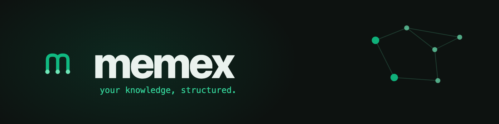

<div align="center">



[](LICENSE)
[](#principles)
[](https://bun.sh)
[](SECURITY.md)

</div>

## The name

In 1945, Vannevar Bush imagined the **memex** — a "memory extender": a desk where a person stores all
their books, records, and notes, and links them by *associative trails* so anything can be found later
by following connections. It's the idea every "second brain" and knowledge base descends from. This is
that idea, rebuilt for the age of AI assistants: a personal memory your models can actually read.

## What it is

**memex is a local-first, text-only knowledge + memory structure that any AI assistant can plug into.**
Plain markdown on your disk — no cloud, no database, no lock-in. memex isn't an app and isn't tied to
any one model; it's the **structure** and the **rules** for how a model talks to your knowledge. Bring
your own assistant.

Three things make it more than a folder of notes:

- **A model-readable index.** Every note carries a one-line summary; `MAP.md` is the always-loaded
  spine an assistant reads first to decide what to open — so a 1M-context model and an 8k local model
  each get a right-sized view.
- **A conversation record.** Two surfaces — a by-day stream and named, attachable chats — let a message
  platform and a chat system both write history without bleeding into each other.
- **A configuration layer.** Every rule, policy, and permission is a knob you own (`CONFIG.md`), and a
  per-model client layer (`clients/models.json`) adapts the whole thing to whatever model is reading it.

## Quickstart

```sh
bunx github:SethMed7/memex init mybrain     # scaffold a memex (zero dependencies)
cd mybrain
bun scripts/validate.ts                      # confirm the structure is sound
```

Then fill `self/00-identity.md`, point your assistant at the folder, and go. Your data is **gitignored
by default**, so the folder is safe to share as a structure.

## The structure

```
mybrain/
  STRUCTURE.md  CONFIG.md  ASSETS.md   contracts: layout · config rule · asset sync
  self/                                slow-changing facts about the subject (person / system / team)
  wiki/                                focused [[linked]] notes: projects · research · reference · people
  history/<YYYY>/<date>.md             conversation stream, by day (message-platform shape)
  chats/<slug>.md                      named, attachable conversations (chat-system shape)
  clients/models.json                  per-model rules (window · tier · agentic · …)
  MAP.md                               the always-loaded index (summaries + links)
  scripts/                             deterministic tooling — no LLM calls, no deps
```

## Principles

- **Text-only, yours.** Knowledge is markdown on your disk. Binaries live in a separate asset store,
  referenced with `storage:` links (`ASSETS.md`). No proprietary format to migrate out of.
- **Model-aware.** The client layer sizes a context pack to each model — agentic models get a lean spine
  and roam; small local models get a pre-assembled pack trimmed to their window; an unknown model falls
  to the safest, smallest default.
- **Config-driven.** Every rule/policy/permission is a knob, governed by the Configuration Rule in
  `CONFIG.md` (knob-not-constant · safe defaults · secrets never in config · …).
- **The memex makes no LLM calls.** It holds only the configuration for *how* a model talks to it; the
  reasoning, drafting, and distilling are done by whoever plugs in. `scripts/` are deterministic, and the
  validator flags any model call — or committed secret — that sneaks in.
- **Local-first & versioned.** A git repo of plain files. No "push an update" — the structure is a
  versioned contract that won't break what's built on it.

## How assistants plug in

A tool resolves the **logical roots** from `STRUCTURE.md` (never hardcodes paths), records conversations
via `scripts/conversations.ts` (`appendDaily` / `writeChat` / `capture`), reads across them with its
helpers, and sizes context with `scripts/client.ts`. The two conversation surfaces let a message platform
and a chat system share one memex without bleeding. A tool can also **build a memex for a user** by
running `memex init` with their permission — so they never set anything up.

## Security

Offline, text-only, zero-dependency. Secrets live in your OS keychain, never in files; your data is
gitignored by default; the structure makes no network or LLM calls — all enforced by `validate.ts` and
CI on every push. See [`SECURITY.md`](SECURITY.md).

## License

MIT — use it, fork it, build products on it.
